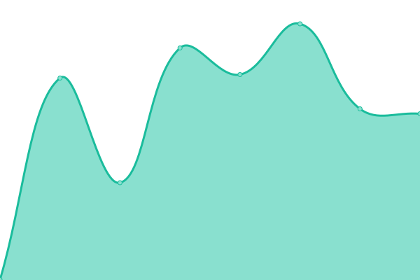

# [📈 Live Status](https://datalab-industries.github.io/status): <!--live status--> **🟩 All systems operational**

This repository contains the open-source uptime monitor and status page for [datalab industries](https://datalab.industries), powered by [Upptime](https://github.com/upptime/upptime).

With [Upptime](https://upptime.js.org), you can get your own unlimited and free uptime monitor and status page, powered entirely by a GitHub repository. We use [Issues](https://github.com/datalab-industries/status/issues) as incident reports, [Actions](https://github.com/datalab-industries/status/actions) as uptime monitors, and [Pages](https://datalab-industries.github.io/status) for the status page.

<!--start: status pages-->
<!-- This summary is generated by Upptime (https://github.com/upptime/upptime) -->
<!-- Do not edit this manually, your changes will be overwritten -->
<!-- prettier-ignore -->
| URL | Status | History | Response Time | Uptime |
| --- | ------ | ------- | ------------- | ------ |
|  [API](https://avnos-datalab-api.matgenix.com/healthcheck/is_ready) | 🟩 Up | [api.yml](https://github.com/datalab-industries/status/commits/HEAD/history/api.yml) | 

 415ms
     
 | 

<a href="https://datalab-industries.github.io/status/history/api">100.00%</a>
    

|  [App](https://avnos-datalab.matgenix.com) | 🟩 Up | [app.yml](https://github.com/datalab-industries/status/commits/HEAD/history/app.yml) | 

 477ms
     
 | 

<a href="https://datalab-industries.github.io/status/history/app">100.00%</a>
    

|  [Demo API](https://demo-api.datalab-org.io/healthcheck/is_ready) | 🟩 Up | [demo-api.yml](https://github.com/datalab-industries/status/commits/HEAD/history/demo-api.yml) | 

 499ms
     
 | 

<a href="https://datalab-industries.github.io/status/history/demo-api">100.00%</a>
    

|  [Demo app](https://demo.datalab-org.io/) | 🟩 Up | [demo-app.yml](https://github.com/datalab-industries/status/commits/HEAD/history/demo-app.yml) | 

 526ms
     
 | 

<a href="https://datalab-industries.github.io/status/history/demo-app">100.00%</a>
    

|  [thismaterialdoesnotexist.com](https://thismaterialdoesnotexist.com) | 🟩 Up | [thismaterialdoesnotexist-com.yml](https://github.com/datalab-industries/status/commits/HEAD/history/thismaterialdoesnotexist-com.yml) | 

 518ms
     
 | 

<a href="https://datalab-industries.github.io/status/history/thismaterialdoesnotexist-com">100.00%</a>
    

|  [grafana](https://grafana.datalab.industries) | 🟩 Up | [grafana.yml](https://github.com/datalab-industries/status/commits/HEAD/history/grafana.yml) | 

 1153ms
     
 | 

<a href="https://datalab-industries.github.io/status/history/grafana">100.00%</a>
    

|  [odbx](https://odbx.science) | 🟩 Up | [odbx.yml](https://github.com/datalab-industries/status/commits/HEAD/history/odbx.yml) | 

 772ms
     
 | 

<a href="https://datalab-industries.github.io/status/history/odbx">100.00%</a>
    

|  [odbx (OPTIMADE)](https://optimade.odbx.science/v1/structures) | 🟩 Up | [odbx-optimade.yml](https://github.com/datalab-industries/status/commits/HEAD/history/odbx-optimade.yml) | 

 1014ms
     
 | 

<a href="https://datalab-industries.github.io/status/history/odbx-optimade">100.00%</a>
    

|  [odbx (OPTIMADE 2)](https://optimade-gnome.odbx.science/v1/structures) | 🟩 Up | [odbx-optimade-2.yml](https://github.com/datalab-industries/status/commits/HEAD/history/odbx-optimade-2.yml) | 

 2028ms
     
 | 

<a href="https://datalab-industries.github.io/status/history/odbx-optimade-2">100.00%</a>
    

|  [odbx (OPTIMADE 3)](https://optimade-misc.odbx.science/v1/structures) | 🟩 Up | [odbx-optimade-3.yml](https://github.com/datalab-industries/status/commits/HEAD/history/odbx-optimade-3.yml) | 

 1352ms
     
 | 

<a href="https://datalab-industries.github.io/status/history/odbx-optimade-3">100.00%</a>
    

|  [Sun Lab (datalab API)](https://datalab-api.camsunlab.com) | 🟩 Up | [sun-lab-datalab-api.yml](https://github.com/datalab-industries/status/commits/HEAD/history/sun-lab-datalab-api.yml) | 

 513ms
     
 | 

<a href="https://datalab-industries.github.io/status/history/sun-lab-datalab-api">100.00%</a>
    

|  [Sun Lab (datalab app)](https://datalab.camsunlab.com) | 🟩 Up | [sun-lab-datalab-app.yml](https://github.com/datalab-industries/status/commits/HEAD/history/sun-lab-datalab-app.yml) | 

 502ms
     
 | 

<a href="https://datalab-industries.github.io/status/history/sun-lab-datalab-app">100.00%</a>
    

<!--end: status pages-->

[**Visit our status website →**](https://datalab-industries.github.io/status)

## 📄 License

- Powered by: [Upptime](https://github.com/upptime/upptime)
- Code: [MIT](./LICENSE) © [Anand Chowdhary](https://anandchowdhary.com), supported by [Pabio](https://pabio.com)
- Data in the `./history` directory: [Open Database License](https://opendatacommons.org/licenses/odbl/1-0/)
